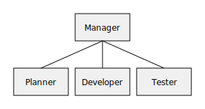

# Tutorial

This tutorial walks through configuring agents and running a workflow with the manager.

## Architecture



## Configuration

Agents are declared in a YAML or JSON file. Example `config/agents.yaml`:

```yaml
objective: "plan feature. implement feature. test feature."
agents:
  planner: {}
  developer: {}
  tester: {}
```

## Running the workflow

Execute the manager via the CLI:

```bash
ollama-crewai-agents -c config/agents.yaml --debug
```

Environment variables may also be used to provide defaults:

```bash
AGENTS_CONFIG=config/agents.yaml AGENTS_DEBUG=1 ollama-crewai-agents
```

## Workflow overview

1. The manager reads the `objective` from the configuration.
2. It splits the objective into discrete tasks.
3. Tasks are dispatched round-robin to the agents.
4. Agents process tasks and report results back to the manager.
